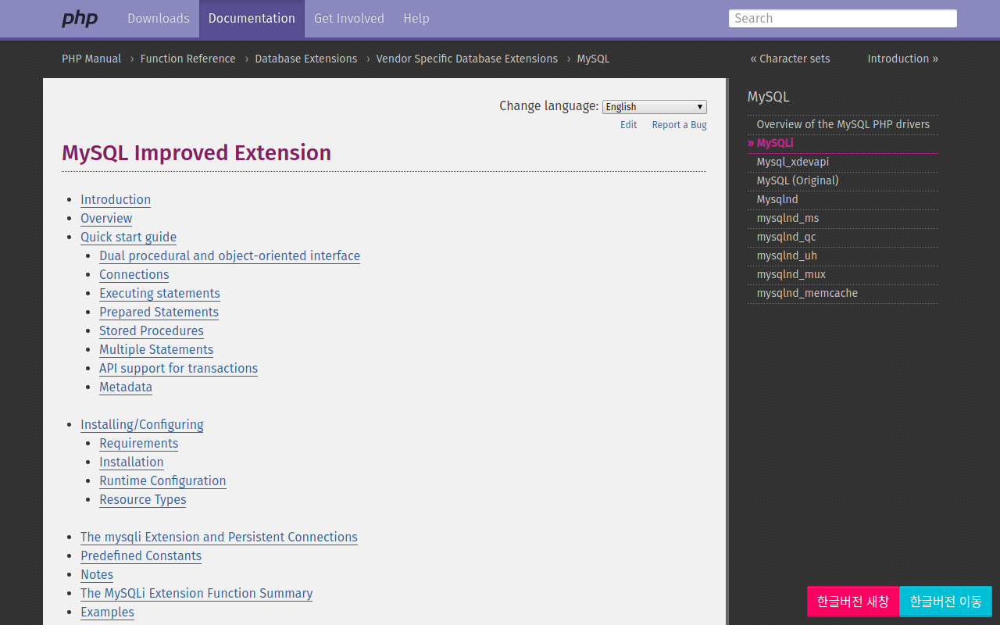
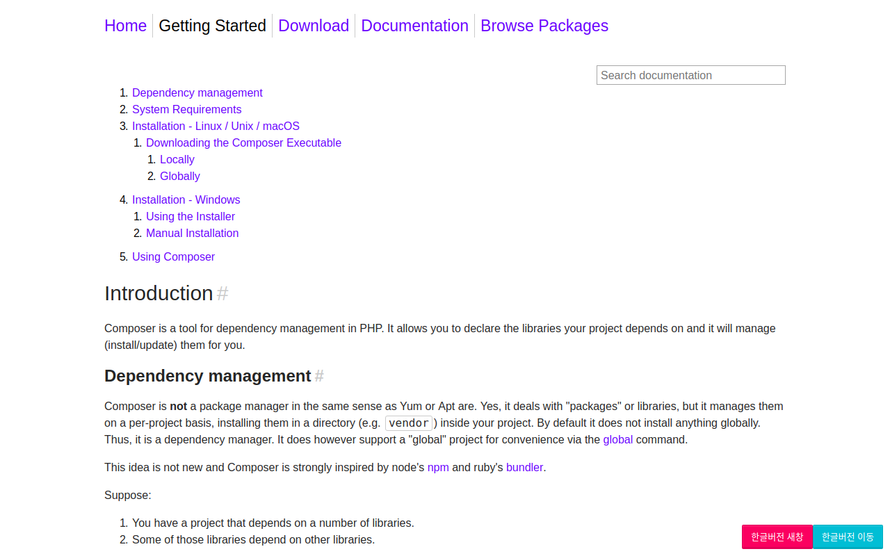
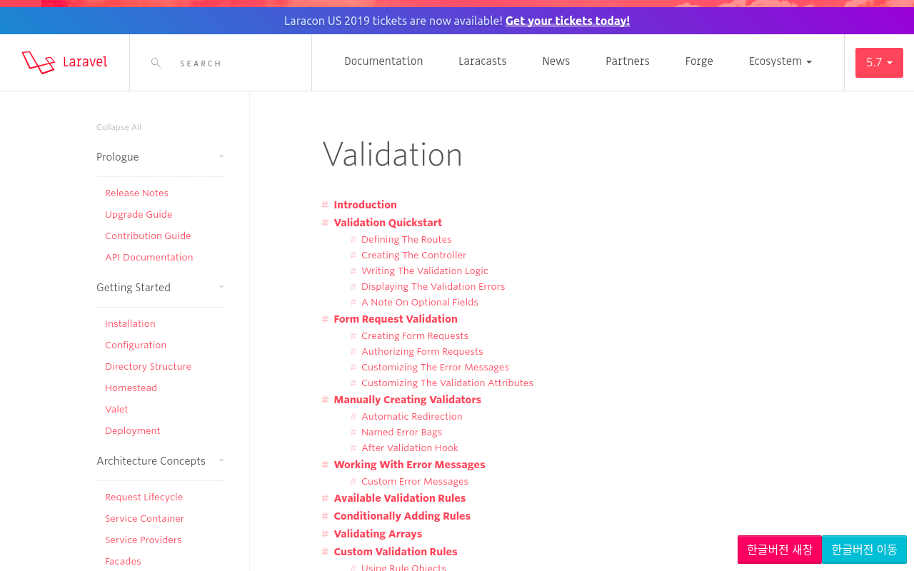
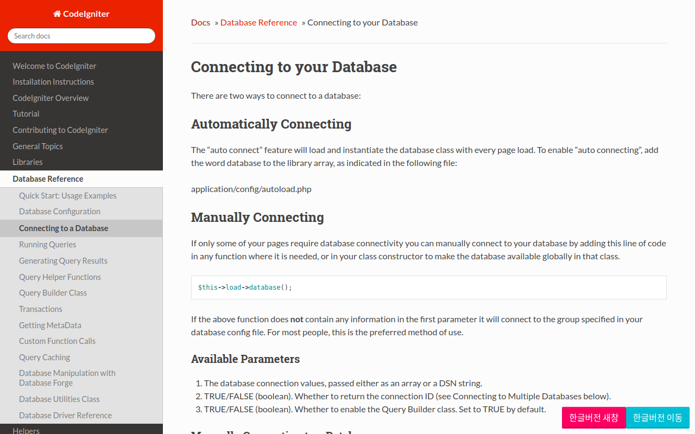

KOREAN DEVELOPER DOCUMENT HELPER
=====

한국인 개발자들의 매뉴얼의 사용성을 향상시켜주는 플러그인 입니다

- [크롬 스토어 바로가기](https://chrome.google.com/webstore/detail/khehbedidjckdgjefapaojgaconkbpei/)
- [파이어폭스 애드온 바로가기](https://addons.mozilla.org/en-US/firefox/addon/korean-developer-manual-helper/)

Screenshots
-----

## php
### php.net

### Composer

### Laravel

### Codeigniter

Issues
-----

이슈는 [[여기](http://github.com/kkame/korean-developer-document-helper/issues)]에 등록해주세요.

License
-----

[MIT](http://opensource.org/licenses/MIT)

